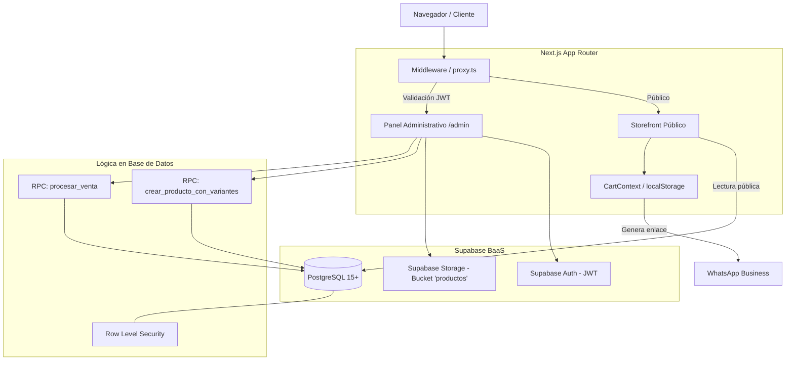

# Arquitectura del Sistema — WEEKSPORT

Este documento describe las decisiones de diseño técnico, la estructura de componentes, los patrones de renderizado, la gestión del estado y el modelo transaccional de **WEEKSPORT**.

---

## 1. Visión y Enfoque General

El sistema combina dos contextos operativos con requisitos técnicos diferenciados:

1. **Storefront (Catálogo Público):** Diseñado para carga rápida, renderizado híbrido (SSR + Client Islands), indexabilidad (SEO) y checkout directo vía WhatsApp sin fricción de registro.
2. **Back-Office / ERP Ligero (`/admin`):** Diseñado para operaciones transaccionales seguras (CRUD de inventario, matriz de variantes, punto de venta POS, analítica y personalización del sitio).

---

## 2. Arquitectura de Frontend (Next.js App Router)

### 2.1. Estrategia de Renderizado (RSC vs. Client Components)

- **Server Components (RSC):** Utilizados en layouts y páginas base para reducir la carga de JavaScript en el cliente y resolver metadata.
- **Client Components (`'use client'`):** Utilizados en componentes con interacción táctil, formularios dinámicos, selectores de talles/colores, filtros de catálogo y persistencia en `localStorage`.

### 2.2. Rutas Paralelas e Interceptadas (`Parallel & Intercepting Routes`)

Para la visualización de productos en la tienda se implementa el patrón de intercepción de rutas de Next.js:

- **Ruta real:** `/producto/[id]/page.tsx` (se utiliza cuando el usuario entra directamente mediante un link, recarga la página o comparte la URL).
- **Ruta interceptada:** `@modal/(.)producto/[id]/page.tsx` (se dispara al hacer clic en un producto desde el catálogo principal `/`).

**Beneficios:**
- Permite abrir el producto en un modal interactivo sin perder la posición de scroll ni los filtros aplicados en el catálogo.
- La URL en la barra del navegador se actualiza a `/producto/[id]`, permitiendo copiar y compartir el enlace directo.
- Al cerrar el modal (`router.back()`), el usuario vuelve inmediatamente al catálogo sin recargar la página.

### 2.3. Manejo de Estado

1. **Carrito de Compras (`CartContext`):**
   - Centraliza los items seleccionados (`producto_id`, `variante_id`, `talle`, `color`, `precio`, `cantidad`, `imagen`).
   - Sincroniza su estado con `localStorage` (`cart_items`) para no perder la orden ante recargas del navegador.
2. **Búsqueda y Filtros (`SearchContext`):**
   - Maneja el término de búsqueda de texto, sincronizado con la barra de navegación.

---

## 3. Modelo Transaccional y Capa de Datos (ACID)

Para evitar inconsistencias de inventario, condiciones de carrera o sobreventas, la lógica crítica del negocio no reside en la capa de aplicación, sino que se delega a **procedimientos almacenados (RPCs)** en PostgreSQL con lenguaje `PL/pgSQL`.

### 3.1. Creación Atómica de Productos y Variantes (`crear_producto_con_variantes`)

En lugar de realizar múltiples llamadas de inserción desde el frontend (una para el producto y N para cada variante), el procedimiento realiza:

1. Inserción del registro maestro en `productos`.
2. Consulta de los talles preconfigurados en `talles_por_tipo` según el `tipo_talle` del producto.
3. Inserción en bloque en `variantes_stock` mediante un producto cartesiano (`CROSS JOIN`) entre los talles configurados y la lista de colores ingresada.
4. Si ocurre cualquier error durante el proceso, PostgreSQL revierte toda la transacción de forma automática.

### 3.2. Procesamiento de Ventas y Bloqueo Pesimista (`procesar_venta`)

El registro de ventas en el módulo POS implementa control de concurrencia y validación estricta de existencias:

1. **Recepción del Payload:** Recibe un array JSONB con los items vendidos: `[{"variante_id": "...", "cantidad": 2}, ...]`.
2. **Bloqueo Pesimista (`FOR UPDATE`):** Bloquea a nivel de fila cada variante en `variantes_stock` durante la ejecución de la transacción para evitar que otra venta simultánea descuente el mismo stock.
3. **Validación de Existencias:** Si `cantidad_solicitada > cantidad_disponible`, la función emite una excepción (`RAISE EXCEPTION 'Stock insuficiente...'`) y aborta la operación completa.
4. **Descuento de Stock:** Actualiza `variantes_stock` decrementando la cantidad.
5. **Histórico Inmutable:** Inserta un snapshot en `ventas_historico` con los ítems y precios pactados al momento de la venta.

---

## 4. Autenticación, Middleware y Seguridad

### 4.1. Flujo de Autenticación SSR

La autenticación administrativa utiliza Supabase Auth gestionado con el paquete `@supabase/ssr`:

1. El usuario inicia sesión en `/admin/login` mediante `supabase.auth.signInWithPassword(...)`.
2. Las credenciales generan tokens JWT (`access_token` y `refresh_token`) almacenados en cookies `HttpOnly` y `Secure`.
3. El archivo `proxy.ts` intercepta cada solicitud entrante y ejecuta `updateSession` (`lib/supabase/middleware.ts`):
   - Valida la sesión activa con `supabase.auth.getUser()`.
   - Si un usuario no autenticado intenta entrar a cualquier ruta `/admin/*` (excepto `/admin/login`), es redirigido automáticamente a `/admin/login`.
   - Si un usuario con sesión activa intenta ingresar a `/admin/login`, es redirigido a `/admin`.
   - Renueva automáticamente los tokens de sesión expirados refrescando las cookies en la respuesta HTTP.

### 4.2. Row Level Security (RLS)

PostgreSQL aplica políticas de seguridad por tabla según el rol del cliente:

- **Rol `anon` (Público):** Permiso exclusivo de lectura (`SELECT`) sobre productos activos (`activo = true`), variantes vinculadas a productos activos, categorías y configuración general del sitio. No tiene permisos de inserción, actualización ni eliminación.
- **Rol `authenticated` (Administradores):** Permisos completos de lectura y escritura (`SELECT`, `INSERT`, `UPDATE`, `DELETE`) en todas las tablas del negocio.
- **Restricción de RPCs:** La ejecución de `procesar_venta` tiene el acceso revocado para `anon` (`REVOKE EXECUTE ON FUNCTION public.procesar_venta FROM anon`), exigiendo sesión autenticada.

---

## 5. Gestión de Imágenes y Archivos

- **Almacenamiento:** Bucket público `productos` en Supabase Storage.
- **Estrategia de Nombres:** Nombres aleatorios únicos (`crypto.randomUUID() + extensión`) para evitar colisiones.
- **Galería de Producto:** Array de strings en `productos.imagenes` que guarda las URLs públicas entregadas por la CDN de Supabase. El primer elemento del array actúa como portada principal.

---

## 6. Mantenimiento y Disponibilidad (Keep-Alive)

La capa gratuita de Supabase pausa automáticamente los proyectos de base de datos tras 7 días consecutivos sin consultas entrantes. Para evitar la desconexión del sistema:

1. **GitHub Actions Workflow (`.github/workflows/supabase-keep-alive.yml`):**
   - Ejecuta un cron programado dos veces por semana (miércoles y domingos a las 00:00 UTC).
   - Realiza una solicitud HTTP directa a la API REST de Supabase autenticada con la `SUPABASE_ANON_KEY`.
   - Mantiene activo el cómputo de PostgreSQL sin requerir intervención manual.
2. **Vercel Cron (`web/vercel.json` & `/api/cron/keepalive`):**
   - Endpoint alternativo que realiza consultas de conteo a la tabla `categorias`.
