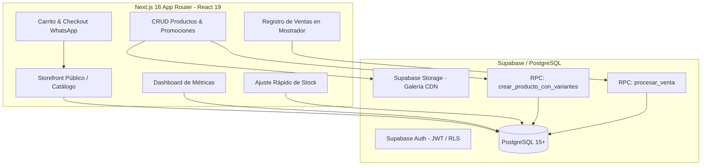

# WEEKSPORT — Plataforma Integral de E-Commerce & Back-Office Operativo (ERP Ligero)

> Sistema integral para la gestión comercial y operativa de **WEEKSPORT**. Combina un storefront público optimizado para conversión con un núcleo administrativo (Back-Office / ERP ligero) diseñado para el control transaccional de inventario multi-variante, registro de ventas en mostrador (POS) y métricas de negocio en tiempo real.

---

## 📌 Visión del Proyecto y Propuesta Técnica

A diferencia de un catálogo digital convencional o una simple pasarela de pedidos, **WEEKSPORT** fue concebido como el **sistema operativo central del negocio**:

1. **Gestión Transaccional con Atomicidad (ACID):** Las operaciones críticas (como el descuento de stock al registrar ventas o la creación masiva de variantes) no delegan la integridad al cliente; se ejecutan mediante **procedimientos almacenados (RPC / PLpgSQL)** en PostgreSQL con rollback automático ante inconsistencias o quiebres de stock.
2. **Matriz de Variantes Dinámica:** Soporta configuraciones dimensionales complejas (Categoría × Género × Esquema de Talle × Color × Precios) con esquemas de talles desacoplados de la lógica dura y persistidos en base de datos (`talles_por_tipo`).
3. **Punto de Venta (POS) & Historial Inmutable:** Permite asentar ventas de mostrador con snapshot histórico de precios y variantes, garantizando trazabilidad contable y auditoría del inventario.
4. **Experiencia de Usuario Híbrida (Storefront + WhatsApp Checkout):** Catálogo ultra-rápido en Next.js 16 (React 19 / Server Components) con carrito persistido y generación automatizada de órdenes listas para procesamiento vía WhatsApp Business.

---

## 🏗️ Arquitectura del Sistema



---

## 🛠️ Stack Tecnológico

| Capa / Módulo | Tecnología | Justificación Técnica |
|---|---|---|
| **Framework Web** | [Next.js 16.3.4](https://nextjs.org/) (App Router) | Renderizado híbrido (RSC + Client Islands), Server Actions y streaming de datos con performance nativa. |
| **Librería UI** | [React 19](https://react.dev/) | Acceso a las últimas APIs de concurrencia, transiciones y hooks de estado. |
| **Tipado** | [TypeScript 5](https://www.typescriptlang.org/) | Tipado estricto end-to-end (Frontend, Payloads RPC y esquemas de BD). |
| **Estilos & Diseño** | [Tailwind CSS v4](https://tailwindcss.com/) | Motor de estilos de última generación, diseño adaptativo mobile-first y tema oscuro de alto contraste. |
| **Base de Datos & Auth** | [Supabase](https://supabase.com/) (PostgreSQL 15+) | Base de datos relacional robusta con Row Level Security (RLS) y autenticación JWT. |
| **Capa Transaccional** | PL/pgSQL (Stored Procedures / RPCs) | Garantía de consistencia ACID, bloqueo de concurrencia y validación de reglas de negocio en BD. |
| **Gestión de Medios** | Supabase Storage (Buckets) | Almacenamiento optimizado de imágenes de producto con entrega vía CDN. |
| **Despliegue** | [Vercel](https://vercel.com/) | Edge Network global, CI/CD automático y optimización de assets estáticos. |

---

## 📦 Módulos del Sistema

### 1. Storefront Público (Experiencia del Cliente)
- **Catálogo Dinámico:** Navegación por categorías y filtros combinados (género, talle, color, rango de precios).
- **Ficha de Producto Detallada:** Selector inteligente de variantes con actualización reactiva de stock disponible, galería interactiva y badges de promociones activas.
- **Motor de Precios Promocionales:** Visualización de precios tachados con cálculo automático de descuentos.
- **Carrito & WhatsApp Checkout:** Carrito local persistente que compila los artículos seleccionados y genera un payload estructurado para concretar la compra vía WhatsApp con el comercio.

### 2. Back-Office / ERP Administrativo
- **Dashboard Ejecutivo:** KPIs en tiempo real (total de productos activos, alertas de productos sin stock, variantes en nivel crítico `<= 1` o `< 3`, últimas ventas registradas).
- **Alta Integral de Artículos (`/admin/inventario/nuevo`):** Formulario maestro que genera automáticamente toda la matriz de talles y colores en un solo paso atómico mediante la RPC `crear_producto_con_variantes`.
- **Control & Gestión de Productos (`/admin/productos`):** Edición completa de datos, reordenamiento de galería de imágenes con drag/drop, toggle de visibilidad en tienda y aplicación de precios promocionales con validaciones de umbral.
- **Ajuste Rápido de Stock (`/admin/stock`):** Interfaz optimizada para inventariado rápido tanto en Desktop (tabla compacta) como en Mobile (BottomSheets táctiles de incremento/decremento directo).
- **Módulo POS / Ventas (`/admin/ventas`):** Registro de transacciones con selección de variantes y ejecución del procedimiento `procesar_venta` para descuento de existencias con snapshots históricos inmutables.

---

## 📁 Estructura del Repositorio

```
WEEKSPORT/
├── web/                           # Aplicación Next.js 16
│   ├── src/
│   │   ├── app/
│   │   │   ├── (store)/           # Rutas públicas del catálogo y checkout
│   │   │   │   ├── @modal/        # Parallel routes / Intercepting routes (modales)
│   │   │   │   └── producto/[id]/ # Ficha de detalle de producto
│   │   │   ├── admin/             # Módulos del Back-Office / ERP
│   │   │   │   ├── inventario/    # Alta de artículos
│   │   │   │   ├── productos/     # Gestión de catálogo y promociones
│   │   │   │   ├── stock/         # Ajuste rápido de inventario
│   │   │   │   └── ventas/        # Terminal POS de registro de ventas
│   │   │   └── globals.css        # Configuración de diseño y Tailwind CSS v4
│   │   ├── components/
│   │   │   ├── admin/             # Componentes de administración (tablas, formularios, modales)
│   │   │   ├── cart/              # Componentes de carrito y drawer
│   │   │   ├── catalog/           # Tarjetas y filtros del catálogo
│   │   │   ├── product/           # Galería y selector de variantes
│   │   │   └── ui/                # Sistema de diseño base (Botones, Badges, Modales, Switches)
│   │   ├── lib/
│   │   │   ├── supabase/          # Clientes Supabase (Browser Client, Server Client SSR)
│   │   │   ├── dashboardService.ts# Métricas y analítica del panel
│   │   │   ├── inventarioService.ts# Orquestación de stock y llamadas RPC
│   │   │   ├── productoService.ts # Mutaciones de catálogo y promociones
│   │   │   ├── variantesService.ts# CRUD individual de variantes
│   │   │   └── ventasService.ts   # Procesamiento transaccional de ventas
│   │   └── types/                 # Interfaces y tipos de dominio (TypeScript)
│   ├── public/                    # Assets estáticos y branding
│   ├── .env.example               # Plantilla de variables de entorno
│   ├── package.json
│   └── tsconfig.json
└── README.md                      # Documentación principal del repositorio
```

---

## 🚀 Puesta en Marcha Local

### Prerrequisitos
- Node.js 20.x o superior
- NPM o PNPM
- Cuenta activa en [Supabase](https://supabase.com)

### 1. Clonar el proyecto e instalar dependencias
```bash
git clone https://github.com/tu-usuario/weeksport.git
cd weeksport/web
npm install
```

### 2. Configurar variables de entorno
Crear un archivo `.env.local` en la carpeta `web/` con las credenciales del proyecto Supabase (**Project Settings → API**):
```env
NEXT_PUBLIC_SUPABASE_URL="https://tu-proyecto.supabase.co"
NEXT_PUBLIC_SUPABASE_ANON_KEY="tu-anon-key-publica"
```

### 3. Configuración de Base de Datos y Funciones RPC
Para una instalación nueva, ejecutar `../supabase/schema.sql`. Para una base existente, seguir `../supabase/DEPLOYMENT.md` y aplicar sólo `../supabase/migrations/202609020001_security_integrity_hardening.sql` después del backup y preflight. No ejecutar parches históricos.

La RPC `crear_producto_con_variantes(...)` recibe cantidades por talle y crea atómicamente la matriz talles × colores. `procesar_venta(...)` descuenta stock con bloqueo pesimista y crea un snapshot server-side inmutable; el navegador sólo envía IDs y cantidades.

### 4. Ejecutar el entorno de desarrollo
```bash
npm run dev
```
La aplicación iniciará en `http://localhost:3000`.

---

## 🔐 Seguridad y Reglas de Negocio

1. **Row Level Security (RLS):**
   - Catálogo público accesible en modo solo lectura (`SELECT`) para `anon` y usuarios autenticados.
   - Modificaciones, inserciones y eliminaciones restringidas al claim server-controlled `app_metadata.role = "admin"`; `authenticated` por sí solo no es administrador.
   - Las variantes públicas requieren producto activo y `visible_en_catalogo = true`; productos inactivos, variantes ocultas y ventas históricas no son legibles por no-admin.
2. **Defensas a Nivel de Base de Datos:**
   - Constraints `CHECK (cantidad >= 0)` en variantes para evitar stock negativo ante condiciones de carrera.
   - Restricciones de unicidad compuestas `UNIQUE (producto_id, talle, color)` para garantizar consistencia del inventario.
3. **Variables Protegidas:**
   - La clave `SERVICE_ROLE` de Supabase jamás se expone en el cliente web ni en variables de entorno públicas. Las claves publishable/anon son identificadores públicos: su seguridad depende de RLS, no de ocultarlas.

4. **Storage:**
   - El bucket público `productos-imagenes` acepta sólo JPEG/PNG/WebP/AVIF hasta 5 MiB; sus escrituras requieren el claim administrador.

5. **Identidad:**
   - Cypher no está integrado. Supabase Auth sigue siendo el único issuer; reevaluar sólo si varios servicios requieren una autoridad común y Cypher ofrece compatibilidad OIDC completa.

---

## 📄 Licencia y Créditos

Desarrollado exclusivamente para **WEEKSPORT**. Todos los derechos reservados.
